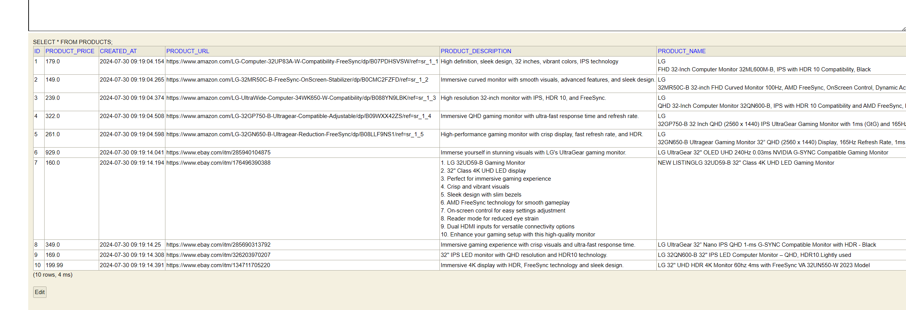

# Product Fetch Application

## Usage

### Fetch Products

To fetch products, use the following CURL request:

```bash
curl --location 'http://localhost:8080/v1/fetch/product' \
--header 'Content-Type: application/json' \
--data '{
    "productName": "LG 32 inch monitor",
    "sortByPrice": "desc"
}'
```
```json
{
    "productList": [
        {
            "productName": "LG UltraGear 32\" OLED UHD 240Hz 0.03ms NVIDIA G-SYNC Compatible Gaming Monitor",
            "productUrl": "https://www.ebay.com/itm/285940104875",
            "productPrice": 929.0,
            "productDescription": "Immerse yourself in stunning visuals with LG's UltraGear gaming monitor.",
            "createdAt": "2024-07-30T13:19:14.041+00:00"
        },
        {
            "productName": "LG UltraGear 32” Nano IPS QHD 1-ms G-SYNC Compatible Monitor with HDR - Black",
            "productUrl": "https://www.ebay.com/itm/285690313792",
            "productPrice": 349.0,
            "productDescription": "Immersive gaming experience with crisp visuals and ultra-fast response time.",
            "createdAt": "2024-07-30T13:19:14.250+00:00"
        },
        {
            "productName": "LG\n32GP750-B 32 Inch QHD (2560 x 1440) IPS UltraGear Gaming Monitor with 1ms (GtG) and 165Hz Refresh Rate, NVIDIA G-SYNC Compatible with AMD FreeSync Premium, Tilt/Height/Pivot Adjustable - Black",
            "productUrl": "https://www.amazon.com/LG-32GP750-B-Ultragear-Compatible-Adjustable/dp/B09WXX42ZS/ref=sr_1_4",
            "productPrice": 322.0,
            "productDescription": "Immersive QHD gaming monitor with ultra-fast response time and refresh rate.",
            "createdAt": "2024-07-30T13:19:04.508+00:00"
        },
        {
            "productName": "LG\n32GN650-B Ultragear Gaming Monitor 32” QHD (2560 x 1440) Display, 165Hz Refresh Rate, 1ms MBR, HDR 10, sRGB 95% Color Gamut, AMD FreeSync – Black",
            "productUrl": "https://www.amazon.com/LG-32GN650-B-Ultragear-Reduction-FreeSync/dp/B08LLF9NS1/ref=sr_1_5",
            "productPrice": 261.0,
            "productDescription": "High-performance gaming monitor with crisp display, fast refresh rate, and HDR.",
            "createdAt": "2024-07-30T13:19:04.598+00:00"
        },
        {
            "productName": "LG\nQHD 32-Inch Computer Monitor 32QN600-B, IPS with HDR 10 Compatibility and AMD FreeSync, Black",
            "productUrl": "https://www.amazon.com/LG-UltraWide-Computer-34WK650-W-Compatibility/dp/B088YN9LBK/ref=sr_1_3",
            "productPrice": 239.0,
            "productDescription": "High resolution 32-inch monitor with IPS, HDR 10, and FreeSync.",
            "createdAt": "2024-07-30T13:19:04.374+00:00"
        },
        {
            "productName": "LG 32\" UHD HDR 4K Monitor 60hz 4ms with FreeSync VA 32UN550-W 2023 Model",
            "productUrl": "https://www.ebay.com/itm/134711705220",
            "productPrice": 199.99,
            "productDescription": "Immersive 4K display with HDR, FreeSync technology and sleek design.",
            "createdAt": "2024-07-30T13:19:14.391+00:00"
        },
        {
            "productName": "LG\nFHD 32-Inch Computer Monitor 32ML600M-B, IPS with HDR 10 Compatibility, Black",
            "productUrl": "https://www.amazon.com/LG-Computer-32UP83A-W-Compatibility-FreeSync/dp/B07PDHSVSW/ref=sr_1_1",
            "productPrice": 179.0,
            "productDescription": "High definition, sleek design, 32 inches, vibrant colors, IPS technology",
            "createdAt": "2024-07-30T13:19:04.154+00:00"
        },
        {
            "productName": "LG 32QN600-B 32\" IPS LED Computer Monitor – QHD, HDR10.Lightly used",
            "productUrl": "https://www.ebay.com/itm/326203970207",
            "productPrice": 169.0,
            "productDescription": "32\" IPS LED monitor with QHD resolution and HDR10 technology.",
            "createdAt": "2024-07-30T13:19:14.308+00:00"
        },
        {
            "productName": "NEW LISTINGLG 32UD59-B 32\" Class 4K UHD LED Gaming Monitor",
            "productUrl": "https://www.ebay.com/itm/176496390388",
            "productPrice": 160.0,
            "productDescription": "1. LG 32UD59-B Gaming Monitor\n2. 32\" Class 4K UHD LED display\n3. Perfect for immersive gaming experience\n4. Crisp and vibrant visuals\n5. Sleek design with slim bezels\n6. AMD FreeSync technology for smooth gameplay\n7. On-screen control for easy settings adjustment\n8. Reader mode for reduced eye strain\n9. Dual HDMI inputs for versatile connectivity options\n10. Enhance your gaming setup with this high-quality monitor",
            "createdAt": "2024-07-30T13:19:14.194+00:00"
        },
        {
            "productName": "LG\n32MR50C-B 32-inch FHD Curved Monitor 100Hz, AMD FreeSync, OnScreen Control, Dynamic Action Sync, Black Stabilizer, Tilt Stand (HDMI), 2023",
            "productUrl": "https://www.amazon.com/LG-32MR50C-B-FreeSync-OnScreen-Stabilizer/dp/B0CMC2FZFD/ref=sr_1_2",
            "productPrice": 149.0,
            "productDescription": "Immersive curved monitor with smooth visuals, advanced features, and sleek design.",
            "createdAt": "2024-07-30T13:19:04.265+00:00"
        }
    ],
    "errors": []
}
```

### Swagger Documentation

Swagger documentation is accessible at:

[http://localhost:8080/swagger-ui/index.html#/](http://localhost:8080/swagger-ui/index.html#/)

### H2 Data Persistence

H2 console can be accessed at:

[http://localhost:8080/h2-console](http://localhost:8080/h2-console)

- Database Name: `test`
- Username: `root`
- Password: `admin`
  


### OpenAI Integration

OpenAI is integrated to fill out the product description field. Currently, it returns a dummy response for testing purposes.

## Known Issues

1. **Robot Detection**: CAPTCHA verification can cause Amazon scraping to fail sometimes.
2. **OpenAI**: Currently set to return a dummy response for testing purposes.
3. Availability - available / out of stock - Amazon and eBay Scrapping are unable to determine the product stock details as most of the products are available, and stock availability is not consistent from search page across platforms.

## SortByPrice

The `sortByPrice` field in the CURL request can be set to either `asc` (ascending) or `desc` (descending) to sort the products by price.
